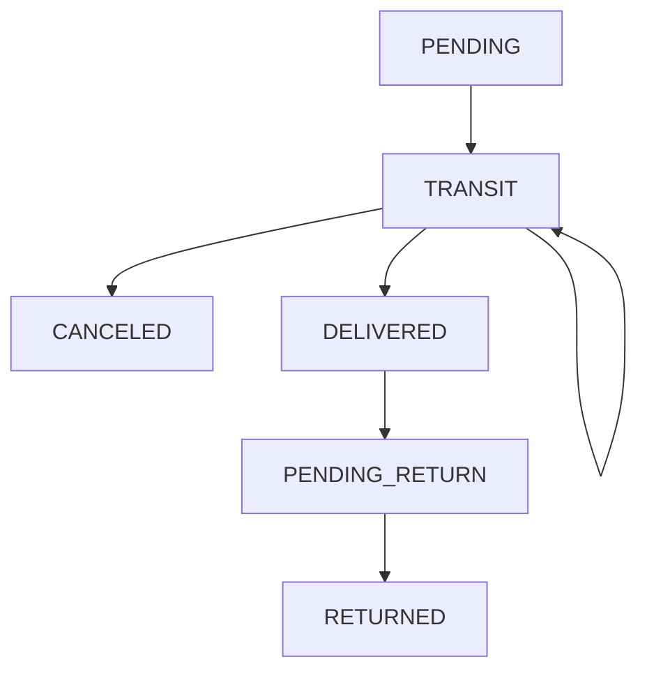
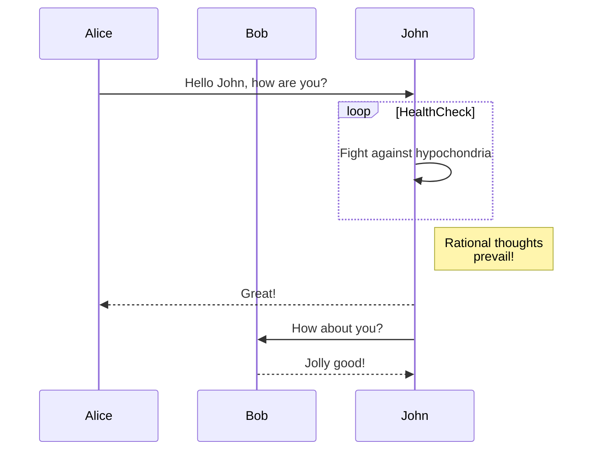

# :mailbox: Microservicio de envíos :mailbox:
---

## Diagrama de Estados de Envíos.



---
## Casos de uso
---
> ### CU-001: Creación de envío
> ---
> - **Precondicion**: La orden de compra debe existir, debe encontrarse en estado *"payment_defined"* ~~y no debe existir envío para esa orden de compra.~~
> - **Camino normal**:
>	1.  Se recibe un evento de creación de un nuevo envío por medio del exchange directo ***"create_delivery"*** desde **orders**, utilizando la queue *"delivery_create_delivery"*.
>	2. ***Opcional***: Se realiza un request a **orders** para validar que la orden existe y está en estado *"payment_defined"*.
>	3. Se valida que no exista un envío para la orderId enviada. Si no existe, se inserta en la tabla *delivery_event* el evento de creación de envío, colocándola con estado "PENDING".
>	4. Se envía un mensaje por medio del exchange directo ***"send_notification"***, con tipo *delivery_created*, para que el servicio de notification realice la notificación.
> - **Caminos alternativos**:
> 	- Si la orden no existe, no se inserta el evento.
> 	- Si el envío para la orden ya existe, no se inserta el evento.
---
---
> ### CU-002: Actualizar ubicación del envío. (este se puede dividir en movimiento de agencia y entrega al destinatario.) (Puede ser por medio de una queue)
> ---
> - **Precondicion**: El usuario debe estar logueado. ~~El envío debe existir.~~ 
> - **Camino normal**:
>	1.  Se recibe un request por interfaz REST indicando la ubicación en la que se encuentra el envío y un parámetro booleano que indica si se entregó el envío al destinatario.
>	2. Se valida que el envío exista y se encuentre en estado **"PENDING**", **"TRANSIT"** o **"PENDING_RETURN"**.
>	3. Se registra el nuevo evento guardando la última ubicación conocida y cambiando el estado según: 
>    	- Si no se está entregando al destinatario y:
>       	- Si el estado era **"PENDING"**, se lo pasa a **"TRANSIT"**.
>        	- Si el estado era **"TRANSIT"**, se lo pasa a **"TRANSIT"**.
>			- Si el estado era **"PENDING_RETURN"**, se lo pasa a **"RETURNED"**.
>		- Si se lo está entregando al destinatario y:
>			- Si el estado era **"PENDING"**, se lo pasa a **"DELIVERED"**.
>			- Si el estado era **"TRANSIT"**, se lo pasa a **"DELIVERED"**.
>	4. Si el nuevo estado es **"DELIVERED"**, se envía un mensaje por medio del exchange directo ***"send_notification"***, con tipo *delivery_delivered*, para que el servicio de notification realice la notificación.
>	5. Si el nuevo estado es **"RETURNED"**, se envía un mensaje por medio del exchange directo ***"send_notification"***, con tipo *delivery_returned*, para que el servicio de notification realice la notificación.
> - **Caminos alternativos**:
> 	- Si el envío no existe, se retorna error.
> 	- Si el envío no está en cualquiera de los estados **"PENDING**", **"TRANSIT"** o **"PENDING_RETURN"**, se retorna error.
>	- Si el envío está en estado **"PENDING_RETURN"** y se recibe una actualización con el parámetro de entrega al destinatario en verdadero, se devuelve error. 
---
> ### CU-003: Consulta la ubicación de un envío.
> ---
> - **Precondicion**: El usuario debe estar logueado. ~~El envío debe existir y le debe pertenecer al usuario.~~ 
> - **Camino normal**:
>	1. Se recibe un request por interfaz REST solicitando la ubicación del envío.
>	2. Se valida que el envío exista y que le pertenezca al usuario logueado.
>	3. Se consulta la proyección del envío para finalmente devolver la información solicitada.
> - **Caminos alternativos**:
> 	- Si el envío no existe, se retorna error.
> 	- Si el envío existe y no le pertenece al usuario, se retorna error.
---
---
> ### CU-004: Cancelar un envío.
> ---
> - **Precondicion**: El usuario debe estar logueado. ~~El envío debe existir y debe encontrarse en estado **"TRANSIT"**`.~~
> - **Camino normal**:
>	1. Se recibe un request por interfaz REST indicando la intención de cancelar un envío.
>	2. Se valida que el envío exista, le corresponda al usuario logueado y se encuentre en estado **"TRANSIT"**.
>	3. Se registra el nuevo evento cambiando el estado a **"CANCELED"**.
>	4. Se envía un mensaje por medio del exchange directo ***"send_notification"***, con tipo *delivery_canceled*, para que el servicio de notification realice la notificación.
> - **Caminos alternativos**:
> 	- Si el envío no existe o no le pertenece al usuario, se retorna error.
> 	- Si el envío no está en estado **TRANSIT"**, se retorna error.
---
>### CU-005: Solicitar devolución de un envío.
> ---
> - **Precondicion**: El usuario debe estar logueado. ~~El envío debe existir y debe encontrarse en estado **"DELIVERED"**`.~~
> - **Camino normal**:
>	1. Se recibe un request por interfaz REST indicando la intención de devolver un envío.
>	2. Se valida que el envío exista, le corresponda al usuario logueado y se encuentre en estado **"DELIVERED"**.
>	3. Se registra el nuevo evento cambiando el estado a **"PENDING_RETURN"**.
>	4. Si el nuevo estado es **"DELIVERED"**, se envía un mensaje por medio del exchange directo ***"send_notification"***, con tipo *delivery_pending_return*, para que el servicio de notification realice la notificación.
> - **Caminos alternativos**:
> 	- Si el envío no existe o no le pertenece al usuario, se retorna error.
> 	- Si el envío no está en estado **DELIVERED"**, se retorna error.
---
## Modelo de datos

**delivery_event**
- id
- deliveryId
- eventType
- lastKnownLocation
- creationDate
- updateDate

**delivery_projection**
- id
- deliveryId
- trackingNumber
- orderId
- userId
- tracking_events[]:
  - updateDate
  - locationName
  - status
- creationDate
- updateDate

<!-- **tracking_projection**
id
deliveryId
status
lastKnownLocation
creationDate
updateDate -->

### Interfaz REST

**Actualizar ubicación del envío**
`PUT /v1/delivery/{trackingNumber}`

*Headers*
Authorization: Bearer token

*Uri param*
trackingNumber

*Body*
```json
{
	"state": "TRANSIT",
	"location": "Agencia calle san martin 1234"
}
```

*Response*
`200 OK` si existe el envío con el trackingNumber enviado.
```json
{
	"message": "Ubicación actualizada exitósamente."
}
```

`404 NOT FOUND` si no existe el Envío con el trackingNumber enviado


#### Creating new/overwriting existing stubs & proxy configs

<details>
 <summary><code>POST</code> <code><b>/</b></code> <code>(overwrites all in-memory stub and/or proxy-config)</code></summary>

##### Parameters

> | name      |  type     | data type               | description                                                           |
> |-----------|-----------|-------------------------|-----------------------------------------------------------------------|
> | None      |  required | object (JSON or YAML)   | N/A  |


##### Responses

> | http code     | content-type                      | response                                                            |
> |---------------|-----------------------------------|---------------------------------------------------------------------|
> | `201`         | `text/plain;charset=UTF-8`        | `Configuration created successfully`                                |
> | `400`         | `application/json`                | `{"code":"400","message":"Bad Request"}`                            |
> | `405`         | `text/html;charset=utf-8`         | None                                                                |

##### Example cURL

> ```javascript
>  curl -X POST -H "Content-Type: application/json" --data @post.json http://localhost:8889/
> ```

</details>

------------------------------------------------------------------------------------------


### Interfaz asincronica (rabbit)

**Validación de stock de un artículo**

Recibe para hacer la validación en direct `stock`
body
```json
{
	"articleId": "23423",
	"quantity": 3,
	"referenceId": "43759834"
}
```

Responde con el resultado de la validación en fanout `stock-check`
body
```json
{
	"articleId": "23423",
	"valid": true,
	"referenceId": "43759834"
}
```


| Syntax      | Description |
| ----------- | ----------- |
| Header      | Title       |
| Paragraph   | Text        |


