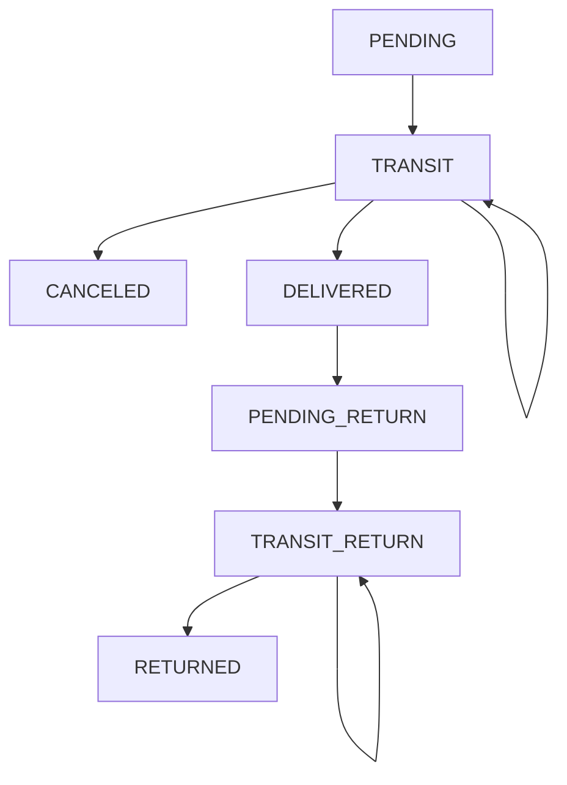

# :mailbox: Microservicio de envíos :mailbox:
---

## Diagrama de Estados de Envíos.



---
## Casos de uso
---
> ### CU-001: Creación de envío
> ---
> - **Precondicion**: La orden de compra debe existir, debe encontrarse en estado *"payment_defined"*. Cualquier evento publicado se considera como válido.
> - **Camino normal**:
>	1.  Se recibe un evento de creación de un nuevo envío por medio del exchange directo ***"create_delivery"*** desde **orders**, utilizando la queue *"delivery_create_delivery"*.
>	2. ***Opcional***: Se realiza un request a **orders** para validar que la orden existe y está en estado *"payment_defined"*.
>	3. Se valida si existe algún evento con el mismo orderId en la tabla *delivery_event*. 
>       - En caso de existir, se obtiene el trackingNumber y se genera el nuevo evento de creación de envío en la tabla *delivery_event* con el **trackingNumber** obtenido y estado **"PENDING"**.
>       -  En caso de no existir otro evento con el mismo orderId, se crea un nuevo trackingNumber y se genera el nuevo evento de creación de envío en la tabla *delivery_event* con dicho ***trackingNumber*** y estado **"PENDING"**.
>	4. Se envía un mensaje por medio del exchange directo ***"send_notification"***, con tipo *delivery_created*, para que el servicio de notification realice la notificación correspondiente.
> - **Caminos alternativos**:
> 	- No posee.
---
---
> ### CU-002: Actualizar ubicación del envío. 
> ---
> - **Precondicion**: El usuario debe estar logueado.
> - **Camino normal**:
>	1.  Se recibe un request por interfaz REST indicando la ubicación en la que se encuentra el envío y un parámetro booleano que indica si se entregó el envío al destinatario.
>	2. Se valida que el envío exista y se recalcula la proyección del mismo, validando también que se encuentre en estado **"PENDING**", **"TRANSIT"**, **"PENDING_RETURN"** o **"TRANSIT_RETURN"**. Se guarda la proyección en la tabla *delivery_projection*, sobreescribiendola si existiera.
>	3. Se registra el nuevo evento guardando la última ubicación conocida y cambiando el estado según: 
>    	- Si no se está entregando al destinatario y:
>       	- Si el estado era **"PENDING"**, se lo pasa a **"TRANSIT"**.
>        	- Si el estado era **"TRANSIT"**, se lo pasa a **"TRANSIT"**.
>			- Si el estado era **"PENDING_RETURN"**, se lo pasa a **"TRANSIT_RETURN"**.
>           - Si el estado era **"TRANSIT_RETURN"**, se lo pasa a **"TRANSIT_RETURN"**.
>		- Si se lo está entregando al destinatario y:
>			- Si el estado era **"PENDING"**, se lo pasa a **"DELIVERED"**.
>			- Si el estado era **"TRANSIT"**, se lo pasa a **"DELIVERED"**.
>           - Si el estado era **"TRANSIT_RETURN"**, se lo pasa a **"RETURNED"**
>	4. Si el nuevo estado es **"DELIVERED"**, se envía un mensaje por medio del exchange directo ***"send_notification"***, con tipo *delivery_delivered*, para que el servicio de notification realice la notificación.
>	5. Si el nuevo estado es **"RETURNED"**, se envía un mensaje por medio del exchange directo ***"send_notification"***, con tipo *delivery_returned*, para que el servicio de notification realice la notificación.
> - **Caminos alternativos**:
> 	- Si el envío no existe, se retorna error.
> 	- Si la proyección del envío no está en cualquiera de los estados **"PENDING**", **"TRANSIT"** o **"PENDING_RETURN"**, se retorna error.
>	- Si la proyección del envío está en estado **"PENDING_RETURN"** y se recibe una actualización con el parámetro de entrega al destinatario en verdadero, se devuelve error. 
---
> ### CU-003: Consulta la ubicación de un envío.
> ---
> - **Precondicion**: El usuario debe estar logueado. 
> - **Camino normal**:
>	1. Se recibe un request por interfaz REST solicitando la ubicación del envío utilizando el trackingNumber.
>	2. Se valida que el envío exista y que le pertenezca al usuario logueado.
>	3. Se consulta la proyección del envío para finalmente devolver la información solicitada.
> - **Caminos alternativos**:
> 	- Si la proyección del envío no existe, se intenta recalcularla.
>   - Si el envío no existe, se retorna error.
> 	- Si el envío existe y no le pertenece al usuario, se retorna error.
---
---
> ### CU-004: Cancelar un envío.
> ---
> - **Precondicion**: El usuario debe estar logueado y debe tener el perfil de Administrador.
> - **Camino normal**:
>	1. Se recibe un request por interfaz REST indicando la intención de cancelar un envío, utilizando el trackingNumber.
>	2. Se valida que el envío exista y le corresponda al usuario logueado. 
>   3. Se recalcula la proyección del mismo y se valida que se encuentre en estado **"TRANSIT"**. Se guarda la proyección en la tabla *delivery_projection*, sobreescribiendola si existiera.
>	4. Se registra el nuevo evento cambiando el estado a **"CANCELED"**.
>	5. Se envía un mensaje por medio del exchange directo ***"send_notification"***, con tipo *delivery_canceled*, para que el servicio de notification realice la notificación.
> - **Caminos alternativos**:
> 	- Si el envío no existe o no le pertenece al usuario, se retorna error.
> 	- Si el envío no está en estado **TRANSIT"**, se retorna error.
---
>### CU-005: Solicitar devolución de un envío.
> ---
> - **Precondicion**: El usuario debe estar logueado.
> - **Camino normal**:
>	1. Se recibe un request por interfaz REST indicando la intención de devolver un envío utilizando el trackingNumber.
>	2. Se valida que el envío exista y le corresponda al usuario logueado.
>   3. Se recalcula la proyección del mismo y se valida que se encuentre en estado **"DELIVERED"**. Se guarda la proyección en la tabla *delivery_projection*, sobreescribiendola si existiera.
>	4. Se registra el nuevo evento cambiando el estado a **"PENDING_RETURN"**.
>	5. Se envía un mensaje por medio del exchange directo ***"send_notification"***, con tipo *delivery_pending_return*, para que el servicio de notification realice la notificación.
> - **Caminos alternativos**:
> 	- Si el envío no existe o no le pertenece al usuario, se retorna error.
> 	- Si la proyección del envío no está en estado **"DELIVERED"**, se retorna error.
---
>### CU-006: Calcular la proyección del envío.
> ---
> - **Precondicion**: El usuario debe estar logueado y debe tener el perfil Administrador.
> - **Camino normal**:
>	1. Se recibe un request por interfaz REST indicando la intención de regenerar la proyección utilizando el trackingNumber.
>   2. Se busca la orderId correspondiente al trackingNumber, validando que haya un único orderId para ese trackingNumber.
>   3. Se buscan todos los eventos que tengan el orderId indicado y se ordenan de menor fecha a mayor.
>	4. Se aplican uno a uno los eventos, de menor fecha a mayor, a la proyección, validando que la transición de estados respete el diagrama de estado.
>   5. Se guarda la proyección realizada en la tabla *delivery_projection*, sobreescribiendo el registro si existiera.
>	6. Se retorna la proyección calculada.
> - **Caminos alternativos**:
> 	- Si existen  varias orderId para el mismo trackingNumber, se agrega un registro a la tabla *failed_delivery_proyection* con el trackingNumber, el mensaje "Existen varios orderId para el mismo trackingNumber", y se agregan a trackingEvents todos los eventos con el trackingNumber. Se retorna error indicando el anterior mensaje.
>   - Si existen varios eventos de creación de envíos con el mismo orderId pero distintos trackingNumber, se toma el trackingNumber más reciente.
> 	- Si existe una inconsistencia en la transición de un estado, se agrega un registro a la tabla *failed_delivery_proyection* con el trackingNumber, el orderId, el mensaje "Hay una transición inconsistente. No se puede pasar del estado ${Origen} al estado ${Destino}", y se agregan a trackingEvents todos los eventos con el mismo orderId. Se retorna error indicando el anterior mensaje.
---
>### CU-007: Listar los envíos del sistema
> ---
> - **Precondicion**: El usuario debe estar logueado y debe tener el perfil Administrador.
> - **Camino normal**:
>	1. Se recibe un request por interfaz REST indicando la intención de obtener el listado de envíos del sistema, opcionalmente enviando filtros.
>   2. Si se realiza la búsqueda de todos los envíos del sistema, ordenados por *creation_date* y paginados de a 20 registros.
>   3. El sistema devuelve el listado.
> - **Caminos alternativos**:
> 	- Si el usuario envía algún parámetro de búsqueda, el sistema busca los envíos que cumplan con los filtros indicados.
---
## Modelo de datos


### Tabla: *delivery_event*


|   column          |   type    |   description                                             |
|-------------------|---------- |-----------------------------------------------------------|
|   id              |   string  | identificador del evento                                  |
|   orderId         |   string  | identificador de la orden                                 |
|   trackingNumber  |   string  | Número de envío. Utilizado para realizar el tracking      |
|   eventType       | [PENDING, TRANSIT, CANCELED, DELIVERED, PENDING_RETURN, RETURNED]     | identificador del movimiento | 
| lastKnownLocation | string    | indica cuál es la última ubicación conocida en el evento  |
| creationDate      | Date      |  fecha de creación del evento                             |
| updateDate        | Date      |  fecha de actualización del evento                        |


### Tabla: *delivery_projection*
|   column          |   type    |   description                                             |
|-------------------|---------- |-----------------------------------------------------------|
|   orderId         |   string  | identificador de la orden                                 |
|   userId          |   string  | identificador del usuario de la orden                     |
|   trackingNumber  |   string  | Número de envío. Utilizado para realizar el tracking      |
|   status          | [PENDING, TRANSIT, CANCELED, DELIVERED, PENDING_RETURN, RETURNED]     | Estado del envío | 
| lastKnownLocation | string    | indica cuál es la última ubicación conocida en el evento  |
| trackingEvents    | Array     | Array de eventos del envío de tipo `{updateDate, locationName, eventType}`  |
| creationDate      | Date      |  fecha de creación del evento                             |
| updateDate        | Date      |  fecha de actualización del evento                        |

### Tabla: *failed_delivery_projection*
|   column          |   type    |   description                                             |
|-------------------|---------- |-----------------------------------------------------------|
|   orderId         |   string  | identificador de la orden                                 |
|   userId          |   string  | identificador del usuario de la orden                     |
|   trackingNumber  |   string  | Número de envío. Utilizado para realizar el tracking      |
| failMessage       | string    | indica cuál fue el problema al generar la proyección.     |
| trackingEvents    | Array     | Array de eventos del envío de tipo `{ updateDate, locationName, eventType}`  |
| creationDate      | Date      |  fecha de creación del evento                             |
| updateDate        | Date      |  fecha de actualización del evento                        |


--------
--------

## Interfaz REST

#### Obtener ubicación del envío

<details>
 <summary><code>GET</code> <code><b>/v1/delivery/{trackingNumber}</b></code> <code>Obtiene la ubicación del envío</code></summary>

##### Headers

> | name      			|  type     | data type               	| description                                                           |
> |---------------------|-----------|---------------------------|-----------------------------------------------------------------------|
> | Authorization      	|  required | Bearer {token}   			|  Bearer token |

##### Uri Params

> | name      			|  type     | data type               | description                                                           |
> |---------------------|-----------|-------------------------|-----------------------------------------------------------------------|
> | trackingNumber      |  required | string    			  |  Tracking number  |

##### Responses

> | http code     | content-type        | response                                                            |
> |---------------|---------------------|---------------------------------------------------------------------|
> | `200`         | `application/json`	| `{"orderId":"1234", "status": "TRANSIT", "lastKnowLocation": "Agencia 1", "deliveryEvents": [{ "updateDate": "2024-11-10", "lastKnownLocation": "Agencia 1", "eventType": "TRANSIT"}]}`                               |
> | `404`         | `application/json`	| `{"code":"404","message":"El envío solicitado no existe."}`                            |
##### Example cURL

> ```
>  curl -X GET -H "Content-Type: application/json" -H "Authorization: Bearer 123asd" --data '{"orderId":"1234", "trackingNumber": "1234", "status": "TRANSIT", "lastKnowLocation": "Agencia 1", "deliveryEvents": [{ "updateDate": "2024-11-10", "lastKnownLocation": "Agencia 1", "eventType": "TRANSIT"}]}' http://localhost:3000/v1/delivery/{trackingNumber}
> ```

##### Response
> Status Code: `200 OK`
>```json
>{
>	"orderId":"1234", 
>	"trackingNumber": "1234",
>	"status": "TRANSIT", 
>	"lastKnowLocation": "Agencia 1", 
>	"deliveryEvents": [{ 
>		"updateDate": "2024-11-10", 
>		"lastKnownLocation": "Agencia 1", 
>		"eventType": "TRANSIT"
>	}, { 
>		"updateDate": "2024-11-09", 
>		"lastKnownLocation": "Depósito", 
>		"eventType": "PENDING"
>	}] 
>}
>```

</details>


#### Actualizar ubicación del envío

<details>
 <summary><code>PUT</code> <code><b>/v1/delivery/{trackingNumber}</b></code> <code>Actualiza ubicación del envío</code></summary>

##### Headers

> | name      |  type     | data type               | description                                                           |
> |-----------|-----------|-------------------------|-----------------------------------------------------------------------|
> | Authorization      |  required | Bearer {token}   |  Bearer token |

##### Uri Params

> | name      |  type     | data type               | description                                                           |
> |-----------|-----------|-------------------------|-----------------------------------------------------------------------|
> | trackingNumber      |  required | string    |  Tracking number  |

##### Body

> | name                   |  type          | data type               | description                                                           |
> |------------------------|----------------|-------------------------|----------------------------------------------------------------|
> | lastKnownLocation      |  required      | string                  |  Última ubicación conocida  |
> | delivered              |  required      | boolean                 | Indica si el envío se entregó al destinatario  |

##### Responses

> | http code     | content-type                      | response                                                            |
> |---------------|-----------------------------------|---------------------------------------------------------------------|
> | `200`         | `application/json`       | `{"message":"Ubicación actualizada exitósamente."}`                               |
> | `404`         | `application/json`                | `{"code":"404","message":"El envío solicitado no existe."}`                            |
##### Example cURL

> ```
>  curl -X PUT -H "Content-Type: application/json" -H "Authorization: Bearer 123asd" --data '{ "lastKnownLocation": "Agencia 1", "delivered": false}' http://localhost:3000/v1/delivery/{trackingNumber}
> ```

##### Response
> Status Code: `200 OK`
>```json
>{
>	"message": "Ubicación actualizada exitósamente."
>}
>```

</details>


#### Cancelar el envío

<details>
 <summary><code>DELETE</code> <code><b>/v1/delivery/{trackingNumber}</b></code> <code>Cancela el envío</code></summary>

##### Headers

> | name      |  type     | data type               | description                                                           |
> |-----------|-----------|-------------------------|-----------------------------------------------------------------------|
> | Authorization      |  required | Bearer {token}   |  Bearer token |

##### Uri Params

> | name      |  type     | data type               | description                                                           |
> |-----------|-----------|-------------------------|-----------------------------------------------------------------------|
> | trackingNumber      |  required | string    |  Tracking number  |

##### Responses

> | http code     | content-type                      | response                                                            |
> |---------------|-----------------------------------|---------------------------------------------------------------------|
> | `200`         | `application/json`       | `{"message":"Envío cancelado exitósamente."}`                               |
> | `404`         | `application/json`                | `{"code":"404","message":"El envío solicitado no existe."}`                            |
##### Example cURL

> ```
>  curl -X DELETE -H "Content-Type: application/json" -H "Authorization: Bearer 123asd" http://localhost:3000/v1/delivery/{trackingNumber} 
> ```

##### Response
> Status Code: `200 OK`
>```json
>{
>	"message": "Envío cancelado exitósamente."
>}
>```

</details>


#### Solicitar devolución para el envío

<details>
 <summary><code>POST</code> <code><b>/v1/delivery/{trackingNumber}/return</b></code> <code>Inicia el proceso de devolución del envío</code></summary>

##### Headers

> | name      |  type     | data type               | description                                                           |
> |-----------|-----------|-------------------------|-----------------------------------------------------------------------|
> | Authorization      |  required | Bearer {token}   |  Bearer token |

##### Uri Params

> | name      |  type     | data type               | description                                                           |
> |-----------|-----------|-------------------------|-----------------------------------------------------------------------|
> | trackingNumber      |  required | string    |  Tracking number  |

##### Responses

> | http code     | content-type                      | response                                                            |
> |---------------|-----------------------------------|---------------------------------------------------------------------|
> | `200`         | `application/json`       | `{"message":"Se inició el proceso de devolución existósamente."}`                               |
> | `404`         | `application/json`                | `{"code":"404","message":"El envío solicitado no existe."}`                            |
##### Example cURL

> ```
>  curl -X POST -H "Content-Type: application/json" -H "Authorization: Bearer 123asd" http://localhost:3000/v1/delivery/{trackingNumber}/return 
> ```

##### Response
> Status Code: `200 OK`
>```json
>{
>	"message": "Se inició el proceso de devolución existósamente."
>}
>```

</details>

#### Realizar la proyección para el envío (Sólo para el administrador)

<details>
 <summary><code>POST</code> <code><b>/v1/delivery/{trackingNumber}/project</b></code> <code>Realiza la proyección para el envío</code></summary>

##### Headers

> | name      |  type     | data type               | description                                                           |
> |-----------|-----------|-------------------------|-----------------------------------------------------------------------|
> | Authorization      |  required | Bearer {token}   |  Bearer token |

##### Uri Params

> | name      |  type     | data type               | description                                                           |
> |-----------|-----------|-------------------------|-----------------------------------------------------------------------|
> | trackingNumber      |  required | string    |  Tracking number  |

##### Responses

> | http code     | content-type                      | response                                                            |
> |---------------|-----------------------------------|---------------------------------------------------------------------|
> | `200`         | `application/json`	| `{"orderId":"1234", "status": "TRANSIT", "lastKnowLocation": "Agencia 1", "deliveryEvents": [{ "updateDate": "2024-11-10", "lastKnownLocation": "Agencia 1", "eventType": "TRANSIT"}]}`                               |
> | `404`         | `application/json`                | `{"code":"404","message":"El envío solicitado no existe."}`                            |
> | `500`         | `application/json`                | `{"code":"500","message":"Existen varios orderId para el mismo trackingNumber."}`                            |


##### Example cURL

> ```
>  curl -X POST -H "Content-Type: application/json" -H "Authorization: Bearer 123asd" --data '{"orderId":"1234", "trackingNumber": "1234", "status": "TRANSIT", "lastKnowLocation": "Agencia 1", "deliveryEvents": [{ "updateDate": "2024-11-10", "lastKnownLocation": "Agencia 1", "eventType": "TRANSIT"}]}' http://localhost:3000/v1/delivery/{trackingNumber}/project
> ```

##### Response
> Status Code: `200 OK`
>```json
>{
>	"orderId":"1234", 
>	"trackingNumber": "1234",
>	"status": "TRANSIT", 
>	"lastKnowLocation": "Agencia 1", 
>	"deliveryEvents": [{ 
>		"updateDate": "2024-11-10", 
>		"lastKnownLocation": "Agencia 1", 
>		"eventType": "TRANSIT"
>	}, { 
>		"updateDate": "2024-11-09", 
>		"lastKnownLocation": "Depósito", 
>		"eventType": "PENDING"
>	}] 
>}
>```

</details>


#### Listar los envíos del sistema

<details>
 <summary><code>GET</code> <code><b>/v1/delivery</b></code> <code>Retorna el listado de envíos</code></summary>

##### Headers

> | name      |  type     | data type               | description                                                           |
> |-----------|-----------|-------------------------|-----------------------------------------------------------------------|
> | Authorization      |  required | Bearer {token}   |  Bearer token |

##### Query Params

> | name      |  type     | data type               | description                                                           |
> |-----------|-----------|-------------------------|-----------------------------------------------------------------------|
> | status      |  not required | string    |  Estado a filtrar. Puede ser alguno de ["PENDING", "TRANSIT", "CANCELED", "DELIVERED", "PENDING_RETURN", "TRANSIT_RETURN", "RETURNED"] |
> | startDate      |  not required | Date    |  Fecha desde a buscar. Se compara contra el created_date |
> | endDate      |  not required | Date    |  Fecha hasta a buscar. Se compara contra el created_date |
> | page      |  not required | number    |  Número de página a devolver. |


##### Responses

> | http code     | content-type                      | response                                                            |
> |---------------|-----------------------------------|---------------------------------------------------------------------|
> | `200`         | `application/json`	| `{"data":[{"orderId":"1234", "status": "TRANSIT", "lastKnowLocation": "Agencia 1"}], "page": 1}`
> | `403`         | `application/json`                | `{"code":"403","message":"No cuenta con los permisos para acceder al recurso."}`                            |
> | `500`         | `application/json`                | `{"code":"500","message":"Hubo un error al listar los envíos del sistema."}`                            |


##### Example cURL

> ```
>  curl -X POST -H "Content-Type: application/json" -H "Authorization: Bearer 123asd" http://localhost:3000/v1/delivery
> ```

##### Response
> Status Code: `200 OK`
>```json
>{
>   "data": [
>       {
>           "orderId":"1234", 
>           "status": "TRANSIT", 
>           "lastKnowLocation": "Agencia 1"
>       }, {
>           "orderId":"1235", 
>           "status": 
>           "DELIVERED", 
>           "lastKnowLocation": "Calle falsa 123"
>       }, {
>           "orderId":"1236", 
>           "status": "PENDING_RETURN", 
>           "lastKnowLocation": "Av. Siempreviva 742"
>       }
>   ],
>   "page": 1
>}
>```

</details>

--------


## Interfaz asincronica (rabbit)

### **Creación de un nuevo envío**

Recibe por medio del exchange direct `create_delivery` a través de la queue `delivery_create_delivery` 
body
```json
{
	"orderId": "23423",
	"userId": "23423",
	"status": "payment_defined"
}
```

### **Pedido de notificación**

Envía por medio del exchange direct `send_notification` a través de la queue `delivery_pending_return` 
body
```json
{
	"notificationType": "delivery_created",
    "userId": "234123",
	"trackingNumber": "12341324"
}
```
